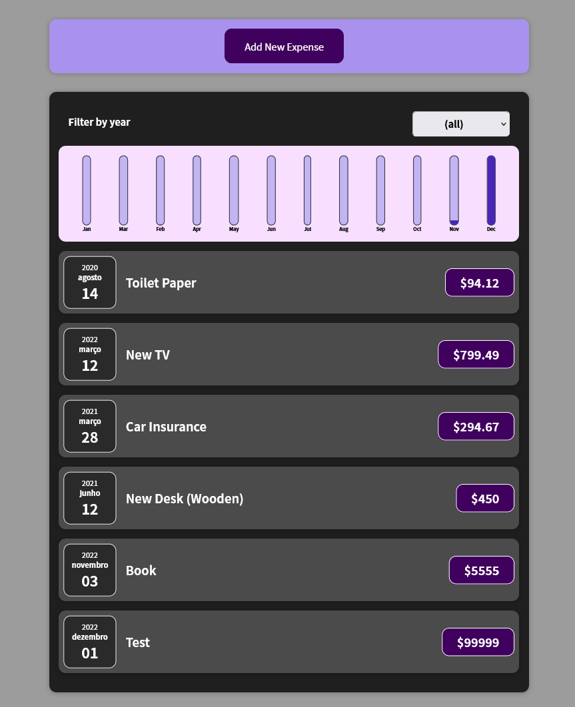

# Expense Tracker 

This is a small project in React that implements a simple Expense Tracker.

It's the result of the Sections 1-6 from the Max Schwarzmüller Udemy React Course.

## How it's organized

There's only one branch, called `development` and 4 tags (`ex1`, `ex2`, `ex3`, `ex4`), each corresponding to my solution to each exercise in the course.

## How to use

Just checkout the code, then install all required dependencies (this will create a `node_modules` folder) and finally run it.

`git clone https://github.com/rdaraujo/react-max-udemy.git`

`cd react-max-udemy`

`npm install`

`npm start`

Then open `http://localhost:3000/`.

